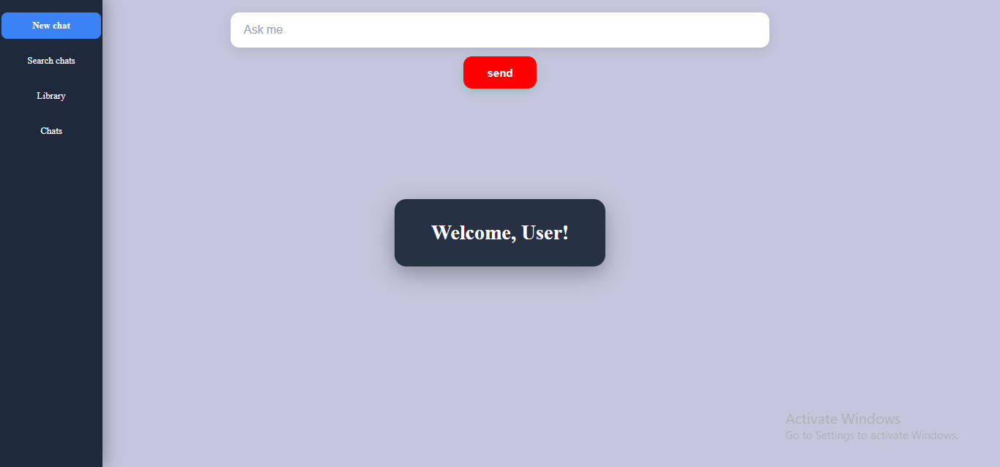
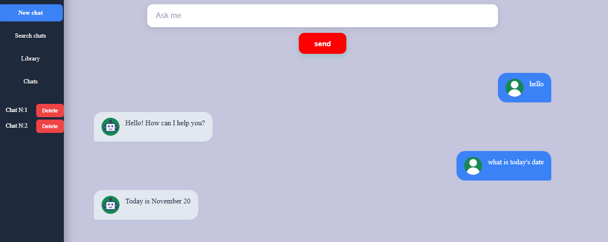

# 🚀 **ABDouchat — Modern Local Chat App (React + Vite)**  

**ABDouchat** is a fully client-side chat application built **100% from scratch** by **Abderrahman Zerouali**.  
Every part of the logic, architecture, UI, data handling, and component structure was carefully planned and implemented by me.

This app is scalable, user-friendly, and supports multiple chat sessions, persistent storage, chat history loading, and message handling — all without any backend.

---

## ⭐ **Features**

### 🔹 **1. Multiple Chat Sessions**
- Create unlimited chats  
- Each chat gets its own **unique ID** (`crypto.randomUUID()`)  
- Chats are auto-named (`Chat N:1`, `Chat N:2`, etc.)

### 🔹 **2. Persistent Chat Storage**
- Chats stored in **localStorage**
- Each session saves:
  - Messages  
  - Sender info  
  - Unique message IDs  
- Chat history stays even after refreshing or closing the app

### 🔹 **3. URL Parameter Routing**
Each chat is accessible using:

```
?id=<chat-id>
```

If a chat ID exists in the URL:
- The app loads the chat  
- Restores messages  
- Jumps directly into the correct session

### 🔹 **4. Sending Messages**
- User sends a message  
- Robot replies using **SuperSimpleDev’s Chatbot**  
- Both messages get saved inside the correct chat session

### 🔹 **5. Deleting Chats**
- Any chat can be deleted  
- Deleting the active chat resets UI + clears URL  
- localStorage updates instantly

### 🔹 **6. Friendly, Clean UI**
- Beautiful CSS styling  
- Sidebar navigation  
- Chat bubbles with icons  
- Smooth and accessible layout  

### 🔹 **7. Scalable Frontend Architecture**
Designed to be:
- Extensible  
- Maintainable  
- Easy to connect with ANY backend  

---

# 🧩 **Project Architecture**

```
src/
│
├── assets/
│   ├── robot.png
│   ├── user.png
│   ├── screenshot1.png
│   ├── screenshot2.png
│
├── components/
│   ├── AiStyling.jsx
│   ├── AiStyling.css
│   ├── Chat_input.jsx
│   ├── Chat_input.css
│   ├── Chat_Message.jsx
│   ├── Chat_Message.css
│
├── App.jsx
├── App.css
├── main.jsx
├── index.css
```

---

# 📸 **Screenshots**

### 🏠 Home Page


### 💬 Chat Interface


---

# 💾 **LocalStorage Format**

```json
{
  "chat-id-1": {
    "name": "Chat N:1",
    "messages": [
      { "message": "Hello", "sender": "user", "id": "123" },
      { "message": "Hi there!", "sender": "robot", "id": "456" }
    ]
  }
}
```

---

# 🔧 **Technologies Used**

- **React 18**  
- **Vite**  
- **LocalStorage API**  
- **URLSearchParams API**  
- **SuperSimpleDev Chatbot**  
- **CSS**  
- **GitHub Pages**  

---

# ▶️ **Running the Project Locally**

```bash
npm install
npm run dev
```

App runs at:  
**http://localhost:5173/**

---

# 🌐 **Live Demo**

🔗 https://lopikola11-cmyk.github.io/vite-project/

---

# 🔮 **Future Improvements**

- Add search functionality  
- Add theme switcher  
- Export/Import chat history  
- Integrate real backend / API  
- Add animations  
- Add voice input  
- Improve mobile UI  

---

# 🔐 **License — All Rights Reserved**

```
Copyright (c) 2025 Abderrahman Zerouali

This project and all files within it are the original work of the copyright holder.
All rights are reserved.

You may NOT copy, use, modify, merge, publish, distribute, sublicense, or sell
any part of this project or its code, in any form or by any means, without
explicit written permission from the copyright holder.

Unauthorized use of this code is strictly prohibited.
```

---

# 👤 **Author**

**Abderrahman Zerouali**  
Creator & Developer of ABDouchat  
100% original design, structure, and implementation
